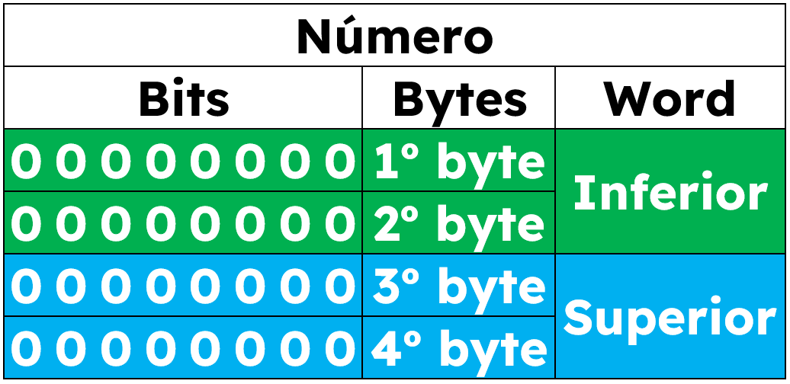

# Estruturas

Uma [estrutura](https://en.wikipedia.org/wiki/Record\_\(computer\_science\)) é um tipo de dado composto, com vários membros.

Exemplos:&#x20;

```
Uma string é uma estrutura com 
  Um caractere inicial e 
  Um caractere final.
```

Uma estrutura vazia ocupa 0 bits na memória, mas você pode definir estruturas de qualquer comprimento adicionando "campos" ou "membros" ao protótipo da estrutura. Esses campos podem ser de qualquer tipo.

O tamanho da estrutura é, em via de rega, igual à soma do tamanho de seus campos.

Porém é possível criar uma "[união](https://en.wikipedia.org/wiki/Union\_type)[ de dados](https://en.wikipedia.org/wiki/Union\_type)" utilizando a palavra-chave **sob**.

Exemplo:

```
Um número é uma estrutura com
  Um primeiro byte, \ 1 byte = 8 bits
  Um segundo byte,
  Um terceiro byte,
  Um quarto byte, \ 4 bytes = 32 bits
  Uma word de ordem inferior sob o primeiro byte,
  Uma word de ordem superior sob o terceiro byte.
  
Uma word é uma estrutura com
  Um byte inicial [high byte] e \ 8 bits
  Um byte final [low byte].    \ + 8 bits  = 16 bits
```

A estrutura `número`, será armazenada da seguinte forma:\


<figure><figcaption></figcaption></figure>

Conforme visto, cada `word`ficará assim:

<figure><figcaption></figcaption></figure>

