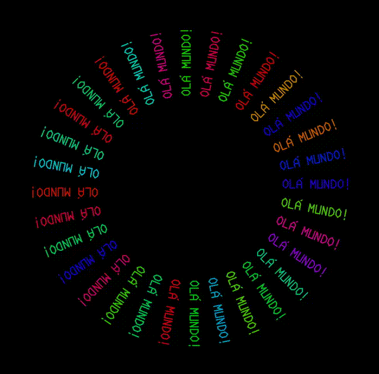

# Olá Mundo

O código abaixo é um exemplo elaborado de uma "Olá Mundo".

> Rotina para que se execute o programa:&#x20;
>
> &#x20; Carregue as bibliotecas padrão do sistema.&#x20;
>
> &#x20; Limpe a tela.\
> &#x20; Use letras de tamanho médio.\
> &#x20; Use a canetinha grossa.&#x20;
>
> &#x20; Itere.&#x20;
>
> &#x20;   Escolha aleatoriamente uma cor escura.
>
> &#x20;   Comece no centro.
>
> &#x20;   Vire 120 graus osmosiansos para a esquerda.&#x20;
>
> &#x20;   Vire à direita.&#x20;
>
> &#x20;   Mova 1 centímetro \[na diagonal].&#x20;
>
> &#x20;   Vire à esquerda.&#x20;
>
> &#x20;   Escreva "OLÁ MUNDO!".&#x20;
>
> &#x20;   Atualize a tela.\
> &#x20;   Adicione 1 para uma contagem.&#x20;
>
> &#x20;   Se a tecla Esc estiver sendo pressionada, pare.&#x20;
>
> &#x20; Reitere.
>
> &#x20; Aguarde a tecla Esc.&#x20;
>
> &#x20; Feche o programa.

<figure><figcaption></figcaption></figure>

O resultado é o seguinte:

<figure><figcaption></figcaption></figure>

