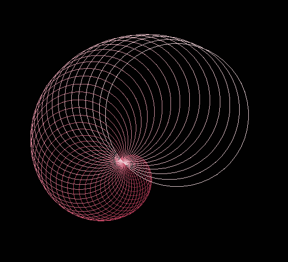
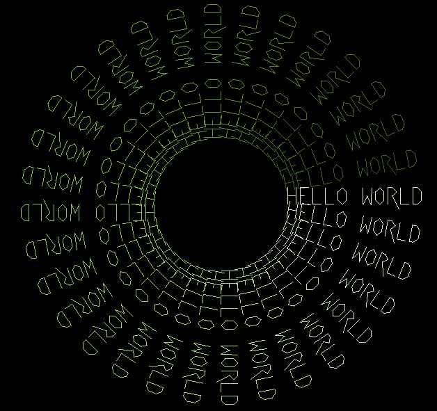
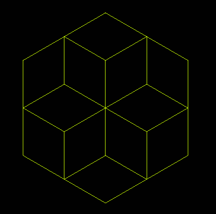
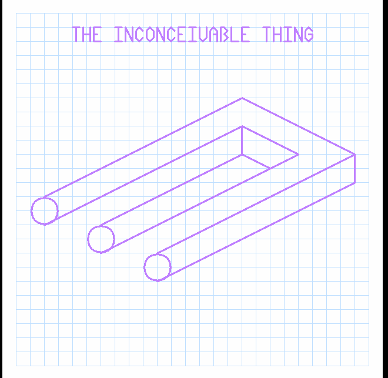
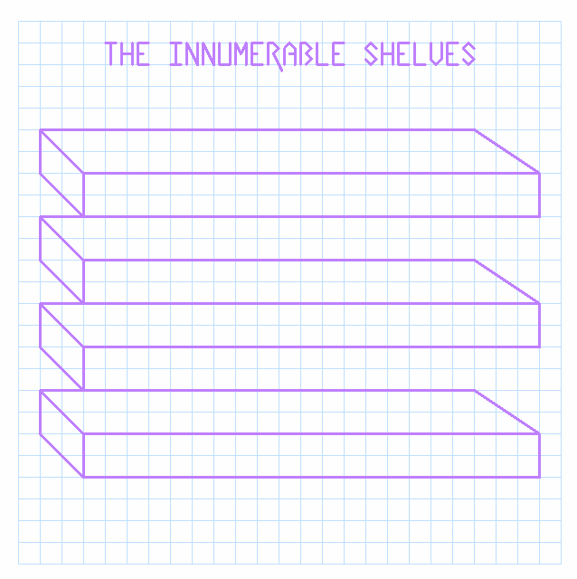
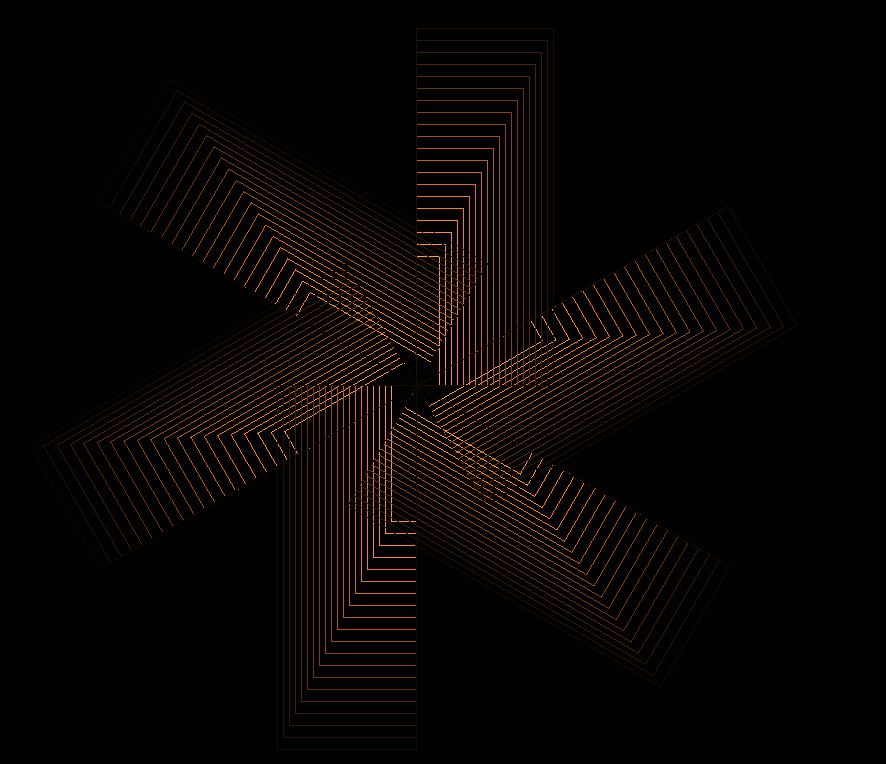
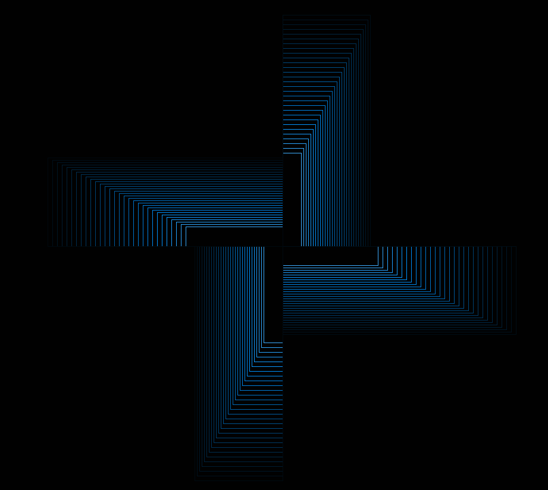
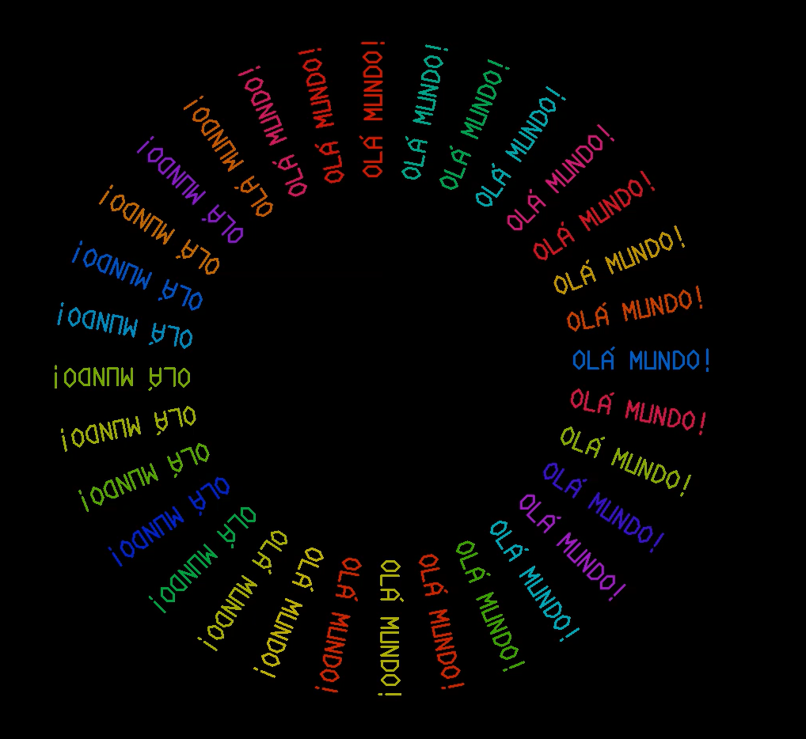

# Gráficos de Tartaruga (Turtle Graphics)

Gráficos tartaruga é um termo em [Computação gráfica](https://pt.wikipedia.org/wiki/Computa%C3%A7%C3%A3o\_gr%C3%A1fica) para um método de programar [desenhos vetoriais](https://pt.wikipedia.org/wiki/Desenho\_vetorial) usando um [cursor](https://pt.wikipedia.org/wiki/Cursor) relativo (a "tartaruga") sob um [plano cartesiano](https://pt.wikipedia.org/wiki/Sistema\_de\_coordenadas\_cartesiano).

A tartaruga possui três atributos:

1. uma localização
2. uma orientação
3. uma caneta, ela própria possuindo atributos tais como cor, espessura, e levantada ou abaixada.

A tartaruga se movimenta com comandos que são relativos à sua própria posição, tais como "mova para frente 10 espaços" e "gire 90 graus para a direita". A caneta transportada pela tartaruga também pode ser controlada, ao habilitá-la, configurando sua cor, ou configurando sua espessura.&#x20;

Exemplos de gráfico de tartaruga:

<figure><figcaption>
Bloom 1
</figcaption></figure>

 

<figure><figcaption>
Bloom 2
</figcaption></figure>

 

<figure><figcaption>
Bloom 3
</figcaption></figure>

 

<figure><figcaption>
Color Wheel
</figcaption></figure>

 

<figure><figcaption>
Escargot
</figcaption></figure>

 

<figure><figcaption>
Formas Geométricas
</figcaption></figure>

 

<figure><figcaption>
Floco de Neve de Koch
</figcaption></figure>

 

<figure><figcaption>
Floresta Fractal
</figcaption></figure>

 

<figure><figcaption></figcaption></figure>

 

<figure><figcaption></figcaption></figure>

 

<figure><figcaption></figcaption></figure>

 

<figure><figcaption></figcaption></figure>

 

<figure><figcaption></figcaption></figure>

 

<figure><figcaption>
Paisagem Deserta
</figcaption></figure>

 

<figure><figcaption></figcaption></figure>

 

<figure><figcaption></figcaption></figure>

 

<figure><figcaption></figcaption></figure>

 

<figure><figcaption></figcaption></figure>

 

<figure><figcaption></figcaption></figure>

 

<figure><figcaption>
Rosa dos Ventos
</figcaption></figure>

 

<figure><figcaption></figcaption></figure>

