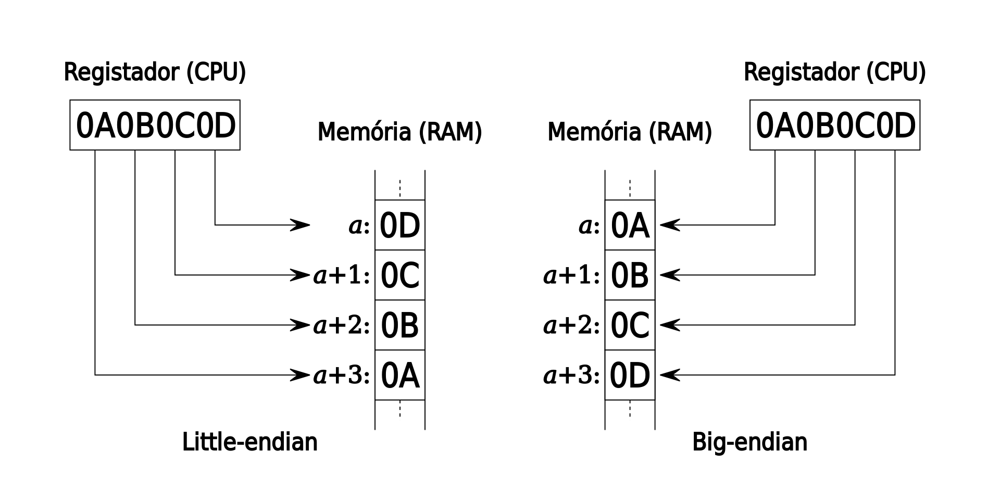

# Valores numéricos

A linguagem trabalha com os seguintes valores numéricos:

* [Bytes](strings-e-caracteres.md#caracteres)
* [Números inteiros;](valores-numericos.md#numeros-inteiros)
* [Números fracionários;](valores-numericos.md#numeros-fracionarios)
* [Números mistos;](valores-numericos.md#numeros-mistos)
* [Valores hexadecimais;](valores-numericos.md#valores-hexadecimais)
* [Ponteiros;](valores-numericos.md#ponteiros)
* [Valores booleanos.](valores-numericos.md#valores-booleanos)

## [Bytes](https://en.wikipedia.org/wiki/Byte)

Bytes são valores numéricos que ocupam 8 [bits ](https://en.wikipedia.org/wiki/Bit)de memória. Bytes e [estruturas](estruturas-e-unioes-de-dados.md) são um [tipo de dado primitivo](https://en.wikipedia.org/wiki/Primitive\_data\_type) a partir do qual são construídos todos os outros tipos da linguagem.

Seu intervalo de valores vai de 0 a 255.&#x20;

A Biblioteca padrão possui rotinas para efetuar operações aritméticas comuns em bytes (e nos demais tipos numéricos abaixo), tais como soma, subtração, multiplicação e divisões inteiras.&#x20;

## [Words](https://pt.wikipedia.org/wiki/Palavra\_\(ci%C3%AAncia\_da\_computa%C3%A7%C3%A3o\)) (Palavras)

As words são compostas por 2 bytes e, consequentemente, ocupam 16 bits de espaço em memória.&#x20;

Words possuem o funcionamento similar ao dos números inteiros, porém seu intervalo de valores vai de -32768 a +32767.&#x20;

Devido às particularidades da arquitetura Windows/Intel x86, os bits em cada um dos bytes da word são armazenados na forma "[little-endian](https://pt.wikipedia.org/wiki/Extremidade\_\(ordena%C3%A7%C3%A3o\))" (da esquerda para a direita), porém os bytes em si são armazenados de forma inversa (ou seja, na forma "[big endian](https://pt.wikipedia.org/wiki/Extremidade\_\(ordena%C3%A7%C3%A3o\))").

<figure><figcaption><p>Demonstração do armazenamento Little-endian vs Big-endian</p></figcaption></figure>

## Números inteiros

Um "número" consiste em dígitos, que podem estar precedidos de um sinal positivo ou negativo. Exemplos:&#x20;

<mark style="color:blue;">`0`</mark>

<mark style="color:blue;">`123`</mark>

<mark style="color:blue;">`-2147483648`</mark>

<mark style="color:blue;">`+2147483647`</mark>

A implementação de um número de 32 bits é a seguinte:

```
Um número é uma estrutura com 
  Um primeiro byte,
  Um segundo byte,
  Um terceiro byte,
  Um quarto byte, \ 4 bytes = 32 bits 
  Uma word de ordem inferior sob o primeiro byte, 
  Uma word de ordem superior sob o terceiro byte.
```

Os números são armazenados de trás para frente (de acordo com o formato "[big-endian](https://pt.wikipedia.org/wiki/Extremidade\_\(ordena%C3%A7%C3%A3o\))") devido à [extremidade (ordenação)](https://pt.wikipedia.org/wiki/Extremidade\_\(ordena%C3%A7%C3%A3o\)) dos processadores x86.

O intervalo de valores do tipo número começa no número -2147483648 chegando até ao número +2147483647.

## Números fracionários

Uma fração é um número seguido de uma barra e um número sem sinal.&#x20;

Exemplos:&#x20;

<mark style="color:blue;">`335/113`</mark>

<mark style="color:blue;">`25946/9545`</mark>

<mark style="color:blue;">`-19601/13860`</mark>

A implementação de uma fração é a seguinte:

```
Uma fração é uma estrutura com
  Um numerador e
  Um denominador.
```


## Números mistos

Um número misto é composto de um número, um traço e uma fração sem sinal. Exemplos:

`1-1/2`

`-2-2/3`

`3-3/4`

Abaixo temos a implementação de números mistos:

```
Um numeral misto é uma estrutura com 
  Um número inteiro e 
  Uma proporção e 
  Uma fração sob a proporção.
```

## Valores Hexadecimais

Os valores hexadecimais são prefixados com o caractere <mark style="color:blue;">`$`</mark>.

Exemplos:

<mark style="color:blue;">`$DEADBEEF`</mark>

<mark style="color:blue;">`$B0DEFE10`</mark>

<mark style="color:blue;">`$AD0BE`</mark>

<mark style="color:blue;">`$0CAF0F0`</mark>

## Ponteiros

Um ponteiro é uma estrutura com 4 bytes, funcionando de forma similar a um número, no sentido que é possível efetuar operações aritméticas comuns (soma, subtração, etc).

Os endereços de memória são armazenados em ponteiros de 32 bits, de trás para frente (formato "[big-endian](https://pt.wikipedia.org/wiki/Extremidade\_\(ordena%C3%A7%C3%A3o\))"). Eles têm o mesmo intervalo dos números, mas todos os negativos pertencem ao Windows. _O endereço 0 é inválido e é denominado <mark style="color:blue;">nulo</mark> ou <mark style="color:blue;">inexistente</mark>_. **Você pode anular um ponteiro para torná-lo nulo.**

## Valores booleanos

Existem 2 valores booleanos:

<mark style="color:blue;">`sim`</mark> (valor 1)  e  <mark style="color:blue;">`não`</mark> (valor 0).

Eles têm 32 bits, mas apenas o bit mais à direita é usado. Na verdade, é o oitavo bit a partir da esquerda, mas você pode pensar nele como o mais à direita. O compilador interpreta 0 como “não” e 1 como “sim”.  Você pode desativar um sinalizador para indicar "não" ou ativar um sinalizador para indicar "sim".
